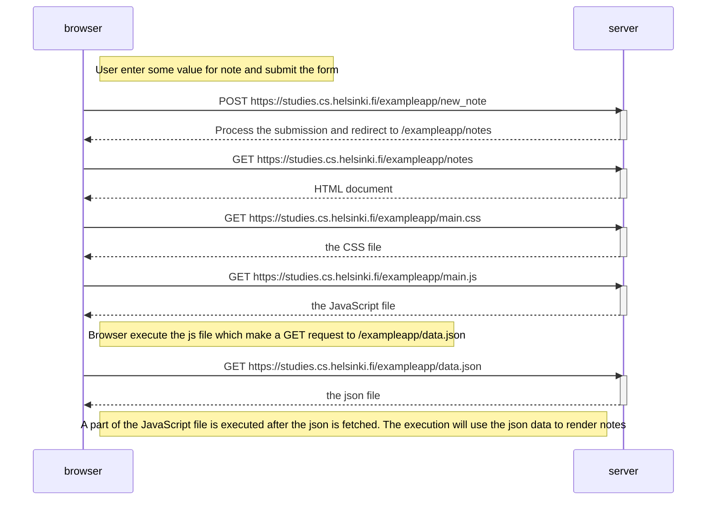

```mermaid
sequenceDiagram
  participant browser
  participant server

  Note right of browser: User enter some value for note and submit the form

  browser->>server: POST https://studies.cs.helsinki.fi/exampleapp/new_note
  activate server
  server-->>browser: Process the submission and redirect to /exampleapp/notes
  deactivate server

  browser->>server: GET https://studies.cs.helsinki.fi/exampleapp/notes
  activate server
  server-->>browser: HTML document
  deactivate server

  browser->>server: GET https://studies.cs.helsinki.fi/exampleapp/main.css
  activate server
  server-->>browser: the CSS file
  deactivate server

  browser->>server: GET https://studies.cs.helsinki.fi/exampleapp/main.js
  activate server
  server-->>browser: the JavaScript file
  deactivate server

  Note right of browser: Browser execute the js file which make a GET request to /exampleapp/data.json

  browser->>server: GET https://studies.cs.helsinki.fi/exampleapp/data.json
  activate server
  server-->>browser: the json file
  deactivate server

  Note right of browser: A part of the JavaScript file is executed after the json is fetched. The execution will use the json data to render notes
```