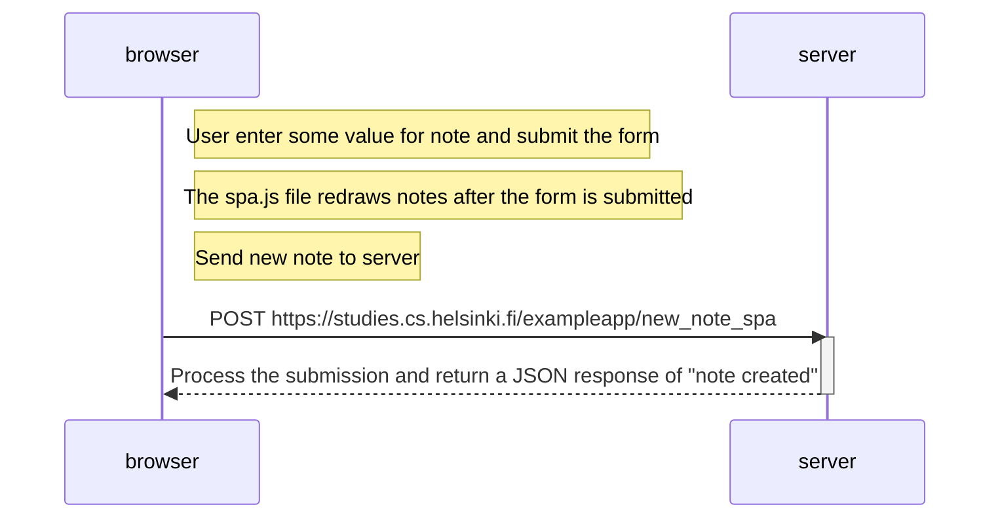

```mermaid
sequenceDiagram
  participant browser
  participant server

  Note right of browser: User enter some value for note and submit the form

  Note right of browser: The spa.js file redraws notes after the form is submitted

  Note right of browser: Send new note to server

  browser->>server: POST https://studies.cs.helsinki.fi/exampleapp/new_note_spa
  activate server
  server-->>browser: Process the submission and return a JSON response of "note created"
  deactivate server

```